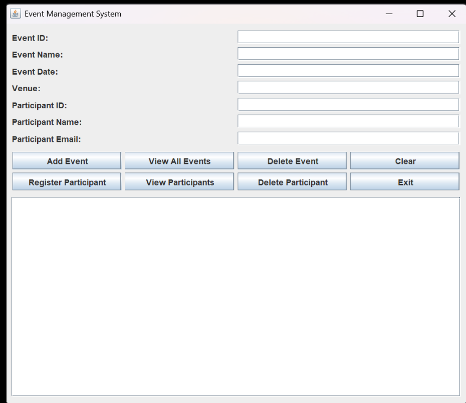

# Event Management System

A basic Java desktop application to create and manage events along with participant registrations using a Swing GUI.



## Features

- Add new events with event ID, name, date, and venue
- View a list of all existing events
- Delete events by event ID
- Register participants with ID, name, and email under specific events
- View participants registered for a particular event
- Remove participants from events
- Clear form fields and output screen

## Project Structure

```text
├── .vscode/               # VS Code workspace settings
├── screenshots/           # Application screenshots (GUI.png)
├── Event.java             # Event entity and participant management logic
├── EventGUI.java          # Java Swing GUI interface
├── EventManager.java      # Console-based event management logic
├── Main.java              # Application entry point
├── Participant.java       # Participant entity (ID, name, email)
├── EventManager.jar       # Pre-built executable JAR package
├── run.bat                # Windows launcher script
├── statement.md           # Problem statement and project scope
├── README.md              # Project overview and setup instructions
└── Event_Management_System_Project_Report_Akshat_Shukla.pdf # Complete project report
```

## Documentation

- [Problem Statement & Scope](statement.md)
- [Project Report (PDF)](Event_Management_System_Project_Report_Akshat_Shukla.pdf)

## Requirements

- Java Development Kit (JDK 8 or higher)

## How to Run

1. Open your terminal or PowerShell in the project folder.
2. Compile all the Java files:
   ```bash
   javac *.java
   ```
3. Run the application:
   ```bash
   java Main
   ```

### Quick Run
- **Via JAR**:
  ```bash
  java -jar EventManager.jar
  ```
- **On Windows**: Double-click `run.bat` or execute `.\run.bat` in PowerShell.

